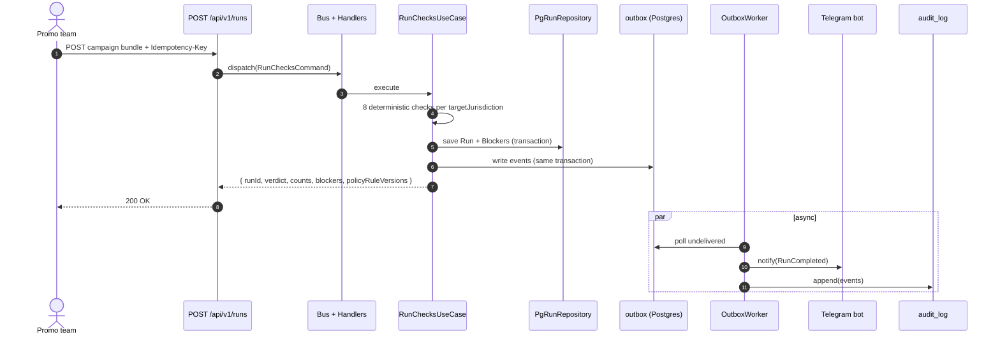
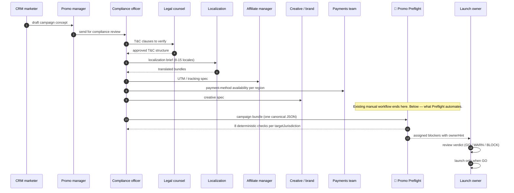

# Promo Preflight

*Deterministic pre-launch workflow checks for campaign bundles. Built by a PM over a weekend with Claude Code.*

*Portfolio demonstration over synthetic campaign scenarios and versioned policy/rule artifacts.*

[](LICENSE) [](https://nextjs.org/) [](https://www.typescriptlang.org/) [](https://github.com/UlaYuga/promo-preflight/actions) [](https://github.com/UlaYuga/promo-preflight/actions/workflows/ci.yml)

<p align="center">
  
</p>

[Live demo](https://promo-preflight-production.up.railway.app/) · [Docs](./docs) · [Case study](./docs/CASE-STUDY.md)

---

## The problem

This portfolio scenario models a promo team reviewing campaign copy, terms, links, owners, and localized channel assets across several markets. When those inputs live in separate documents and chats, reviewers have no single repeatable preflight run to inspect.

The sample operator, markets, review process, and operating impact described here are illustrative. They are not observed operator metrics, enforcement precedents, or statements of applicable law.

Preflight runs 8 deterministic checks per target jurisdiction against versioned YAML policy/rule artifacts before a launch decision. The API also runs 3 runtime policy checks for payment compatibility, crypto disclosure, and jurisdictional-risk labels. One canonical `CampaignBundle` produces `GO` / `WARN` / `BLOCK` findings with an artifact reference and a suggested owner. For authenticated API clients, events route via webhook (Telegram first) and each API run is persisted in an audit log.

Preflight does not determine legal compliance. Qualified compliance and legal owners must review the policy/rule artifacts and any resulting launch decision before production use.

## What this is

Promo Preflight runs 8 deterministic preflight checks against a campaign bundle, then the API adds 3 runtime policy checks backed by validated YAML artifacts. Each check targets a configured review category: terms completeness, flagged phrases, offer math, payment method compatibility, crypto-disclosure text, link health, format constraints, launch ownership, and localization depth. Checks run against versioned YAML policy/rule artifacts: same input and artifact version, same output.

Promo Preflight exposes two deliberate surfaces:

- **Interactive browser demo** — a guided workflow over synthetic sample data. Drafts, reports, campaign versions, and tour state remain in that browser's `localStorage`; the demo does not claim durable server persistence.
- **Protected REST API persistence contract** — `/api/v1/*` accepts authenticated integration requests, persists API runs and policy provenance to Postgres, and supports audit/outbox records.

The browser demo never sends `PREFLIGHT_API_KEY` and does not submit an authenticated API run. Use an authenticated API client or the documented `curl` path to exercise the persisted backend contract.

Runtime policy provenance is part of the persisted API contract. `POST /api/v1/runs`, idempotency replay, `GET /api/v1/runs/:id`, and `GET /api/v1/campaigns/:id/versions` include `policyRuleVersions` for `paymentCompatibility`, `cryptoDisclosure`, and `jurisdictionalRisk`. These values come from `rules/payment-methods-by-region.yaml`, `rules/crypto-disclosure-rules.yaml`, and `rules/forbidden-phrases-by-region.yaml`; changing one of those runtime artifacts must bump its top-level `version`. `rules/rules.yaml` remains documentation/catalog metadata for the 8 core offline checks, not the runtime source for these 3 API policy artifacts.

The protected API accepts one canonical `CampaignBundle` in JSON and returns a `GO` / `WARN` / `BLOCK` verdict with blockers, each tied to a rule ID and a suggested owner role. Every authenticated API run is persisted and logged so responsible owners can review the input, artifact version, and result.

<table>
<tr>
<td width="50%" valign="top"><strong>Before</strong><br>4 tabs, 8 chats, 0 versioning.<br></td>
<td width="50%" valign="top"><strong>After</strong><br>One workspace. Repeatable artifact-based verdict.<br></td>
</tr>
</table>

## Who this is for

| You are | What this gives you |
|---|---|
| A multi-jurisdiction iGaming operator | Surface jurisdiction-tagged policy-artifact findings before a promo launch decision |
| A platform / white-label engineer at a B2B iGaming infrastructure provider | Add a deterministic pre-launch gate to a CRM / Promo workflow while policy ownership stays outside the platform team |
| A CRM / Promo Ops lead launching campaigns across 8-15 locales every month | Replace the Notion → Slack → Google Doc → Excel review chain with one deterministic check and one Telegram alert with assignable owners |

## How it works

Each authenticated API run follows a synchronous request path — validate, dispatch, check, persist, respond — with side effects (Telegram notifications, audit events) handled asynchronously via the outbox pattern. The interactive browser demo is a separate local workflow and is not the caller in this sequence.

### Mermaid: data flow sequence



Preflight slots into an existing review workflow as a deterministic pre-launch gate. The promo, compliance, and legal owners remain responsible for approving the artifacts and the launch decision.

### Mermaid: Preflight in your workflow



Here's an example Telegram notification from the authenticated API workflow:


## Three paths to use

### 1. Self-host via docker-compose

The shortest path to a self-hosted integration instance:

```bash
git clone https://github.com/UlaYuga/promo-preflight.git
cd promo-preflight
cp .env.example .env   # fill PREFLIGHT_API_KEY; fill TELEGRAM_* if needed
docker compose up -d
export PREFLIGHT_API_KEY='replace-with-the-same-key-as-in-.env'
node --disable-warning=MODULE_TYPELESS_PACKAGE_JSON \
  --experimental-strip-types \
  -e "import { workedExamples } from './schemas/worked-examples.ts'; console.log(JSON.stringify({ campaign: workedExamples.EX08.bundle }, null, 2));" \
  > /tmp/preflight-ex08.json
curl -X POST http://localhost:3000/api/v1/runs \
  -H "Authorization: Bearer $PREFLIGHT_API_KEY" \
  -H "Content-Type: application/json" \
  -H "Idempotency-Key: $(uuidgen)" \
  -d @/tmp/preflight-ex08.json | jq
```

See [docs/CONFIGURATION.md](./docs/CONFIGURATION.md) for the full environment variable reference.

### Railway deploy lifecycle

Railway Docker deployments run `node db/migrate.mjs` from the final application image as the `[deploy].preDeployCommand`. The command reads Drizzle's existing `db/migrations/meta/_journal.json` and SQL artifacts, and exits non-zero on failure, preventing `node server.js` from starting. Repeated deploys skip migrations already recorded in `drizzle.__drizzle_migrations`. At runtime, `instrumentation.node.ts` starts only the in-process outbox worker; `/api/ready` reads database connectivity and required-table status without applying migrations.

### 2. Drop into your CI (npm package + CLI)

```bash
cat campaign.json | npm run check
npm run check -- --file ./campaign.json
npm run check -- --file ./campaign.json --format human
```

Exit codes: `0` on GO, `1` on WARN, `2` on BLOCK, `3` on invalid JSON/schema, `4` on internal failure. Use as a build gate in any CI pipeline.

### 3. Managed SaaS

Coming soon. [Email for early access](mailto:alex@marlerino.group).

## Tech stack

| Package | Why |
|---|---|
| `next` 16 | App Router + React Server Components — single process hosts both API and UI |
| `react` 19 | Server Components; concurrent rendering for the run result view |
| `typescript` 6 | Strict mode; all types derived from Zod schemas via `z.infer<>` |
| `tailwindcss` 3.4 | Custom design token palette; no standard Tailwind color classes in UI code |
| `drizzle-orm` + `pg` | Type-safe SQL access; versioned SQL migrations run before Railway starts the application image |
| `zod` | Runtime validation at all system boundaries |
| `vitest` | Fast unit + integration tests; ESM-native, TypeScript path alias support |
| `@anthropic-ai/sdk` | Optional AI augmentation layer; stubbed when `USE_MOCK_AI=true` |
| `yaml` | Parses jurisdiction rule artifacts (`rules/*.yaml`) at boot |
| Telegram Bot API | Outbound run-result alerts to the team channel via the outbox worker |

## Architecture

```
domain/
  model/         # Campaign, Run, Blocker, Owner
  vo/            # Amount, Url, Locale, Severity (branded types)
  service/       # ReadinessCalculator, BlockerDiff (pure functions)
  event/         # PreflightEvent (sealed discriminated union)
  exception/     # PreflightException hierarchy
application/
  command/       # RunChecksCommand, ...
  query/         # FindRunQuery, CampaignDiffQuery, ...
  usecase/       # RunChecksUseCase, VersionDiff, ...
  port/          # IRunRepository, IEventPublisher, IHandoffAdapter, ...
  bus/           # Bus, HandlerRegistry
infrastructure/
  persistence/   # PgRunRepository (Drizzle + Postgres)
  telegram/      # TelegramAdapter
  outbox/        # OutboxEventPublisher, OutboxWorker
  ai/            # Anthropic adapter (optional)
  handler/       # Command/query handler implementations
  registry/      # DI registry, Bus factory
api/
  v1/            # Next.js route handlers (thin — all through Bus)
lib/             # LEGACY — migrating to domain/application in v2.1; do not extend
rules/           # YAML rule artifacts (versioned, human-authored)
schemas/         # Zod contracts (re-exported from domain/)
```

Layer rule: `domain/` → zero dependencies outside itself. `application/` → declares ports, never implements them. `infrastructure/` → implements ports, may import any external library. `api/` → translates HTTP into Bus dispatches, contains no business logic.

Full diagram: [docs/ARCHITECTURE.md](./docs/ARCHITECTURE.md).

## What we deliberately don't do

- No multi-tenant (org-scoped data) — out of scope for this sprint; can be added without changing core
- No gRPC — REST + webhooks fit the consumer model (CRM/Promo Ops teams)
- No live LLM in default checks path — checks must be deterministic and reproducible; AI is an optional augmentation only (see ADR-0003 + ADR-0005 for the planned augmentation roadmap)
- No end-user accounts or browser sign-in — the browser workflow remains a credential-free demo, while every `/api/v1/*` endpoint requires bearer authentication
- No microservices — one process: in production the outbox worker boots inside the Next server via `instrumentation.node.ts`; a standalone `bin/preflight-worker.ts` entrypoint exists for local docker-compose and tests
- No opaque policy score — verdicts are GO / WARN / BLOCK based on configured rule severity, not AI inference

## AI augmentation roadmap

Preflight ships a deterministic-first preflight engine. AI is the planned augmentation layer on top, never the decision-maker.

Five augmentations are scoped for v1.x:

- **PDF / text extraction** — drop a T&C PDF or a free-text campaign brief; AI extracts a structured `CampaignBundle`; the deterministic checks run as normal.
- **Fix suggestion per blocker** — for each `BLOCK`, AI generates 3 locale-aware replacement copy variants that preserve marketing intent.
- **Cultural localization review** — suggests candidate text mismatches for human review where regex rules are insufficient.
- **Plain-language explanation per blocker** — explains why an artifact matched and which rule label produced the finding.
- **Policy-artifact Q&A** — retrieves answers grounded in versioned rule artifacts for responsible-owner review.

See [ADR-0005](./docs/adr/0005-ai-augmentation-roadmap.md) for full reasoning. None of these ship in v1.0; the deterministic kernel does. AI lands incrementally in v1.x.

## Contributing / License / Author

Issues and PRs welcome. Apache 2.0.

Built by Alexander Ulanov — PM with 6+ years in digital production, e-commerce, and TV.
[github.com/UlaYuga](https://github.com/UlaYuga)
