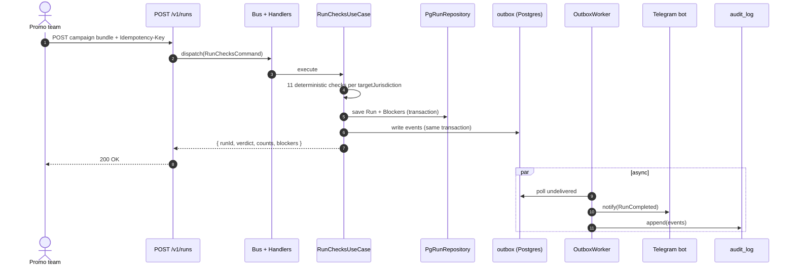

# Promo Preflight

*Pre-launch readiness checks for iGaming operators expanding into emerging markets. Built by a PM over a weekend with Claude Code.*

*Built around the regulatory realities described in the 01.tech × G GATE MEDIA Global iGaming Report 2026.*

[](LICENSE) []() []() [](https://github.com/UlaYuga/promo-preflight/actions) [](https://github.com/UlaYuga/promo-preflight/actions)

<p align="center">
  
</p>

[Live demo](https://promo-preflight-production.up.railway.app/) · [Docs](./docs) · [Case study](./docs/CASE-STUDY.md)

---

## The problem

Every quarter, another regulator updates its rules. Your promo team is still reviewing T&C across eight locales in Google Docs.

- "The key and very underrated trend in 2026, in my view, is not AI or core updates, but the increasing local blockings and regulatory pressure in Latin America and Asia. These began last year and have hit not just products but webmasters too. Infrastructure resilience and tight processes for tracking and reacting to local-operator blocks will be the competitive advantage of this year." — **Stanislav, SEO Product Manager, 01.tech**, *Global iGaming Report 2026*

- "Gamble responsibly as a footer link no longer satisfies several jurisdictions." — **Emmanuel Omoloyin, SEO Content Writer**, *DEEP-RESEARCH §7, citation 169*

- **Perfect Storm B.V.**: €5M fine + 2-year ban, DGOJ Spain (Apr 2026). **Sky Betting & Gaming**: £1.17M, UKGC (2022) — welcome bonus emails sent to self-excluded players. **Kindred (Spooniker)**: SEK 100M, Spelinspektionen (2020) — single-bonus-rule violation. Real money lost when promo compliance fails.

No dedicated tool exists for multi-jurisdiction promo compliance in iGaming. Reviews happen across Slack, Google Docs, Excel, and Notion — one chain per locale, none of it audit-defensible. As Adam Mateja put it: "Promotions in iGaming are one of those things that look simple on paper, and then turn into a lot of manual work."

A mid-size operator runs 20-30 campaigns a month,\* spends an estimated 2-5 person-hours per campaign on compliance review,\* and still pulls or corrects 5-10% of campaigns post-launch.\*

\*Industry estimate per OLD-RESEARCH §2; no public operator metrics published.

Preflight runs 11 deterministic checks per target jurisdiction against versioned YAML rule artifacts — before launch. One canonical `CampaignBundle`, one JSON format. Each check returns `GO` / `WARN` / `BLOCK` with a specific rule reference and a suggested owner. Events route via webhook (Telegram first); every run is written to an audit log.

Built around the regulatory and operational realities described in the 01.tech × G GATE MEDIA Global iGaming Report 2026. Preflight closes the gap that report identifies as 2026's most underrated risk.

## What this is

Promo Preflight runs 11 deterministic compliance checks against a campaign bundle before it goes live. Each check targets a specific risk category: T&C completeness per jurisdiction, forbidden phrases, offer math, payment method compatibility, crypto disclosure rules, link health, format requirements, launch ownership, and localization depth. Checks run against versioned YAML rule artifacts — same input, same output, every time.

The system accepts one canonical `CampaignBundle` in JSON — one format regardless of whether you're launching in Brazil, India, Mexico, or the UK — and returns a `GO` / `WARN` / `BLOCK` verdict with blockers, each tied to a rule ID and a suggested owner role. Every run is persisted and logged; the audit trail holds up to regulatory review.

<table>
<tr>
<td><strong>Before</strong><br>4 tabs, 8 chats, 0 versioning.<br></td>
<td><strong>After</strong><br>One workspace. Verdict in 12 seconds.<br></td>
</tr>
</table>

## Who this is for

| You are | What this gives you |
|---|---|
| A multi-jurisdiction iGaming operator (lic. EU + LATAM + offshore) | Catch jurisdictional risks before promo launches — Brazilian SPA, Indian UPI ban, Mexican SPEI rules, Algerian crypto prohibition |
| A platform / white-label engineer at a B2B iGaming infrastructure provider (01.tech, SoftSwiss, BetConstruct, EveryMatrix tier) | Drop-in pre-launch gate your operator customers can add to their CRM / Promo workflow without your platform team owning compliance |
| A CRM / Promo Ops lead launching campaigns across 8-15 locales every month | Replace the Notion → Slack → Google Doc → Excel review chain with one deterministic check and one Telegram alert with assignable owners |

## How it works

Each run follows a synchronous request path — validate, dispatch, check, persist, respond — with side effects (Telegram notifications, audit events) handled asynchronously via the outbox pattern.

### Mermaid: data flow sequence



Preflight slots into the existing compliance workflow as the final pre-launch gate. The upstream process stays owned by the promo and compliance team; Preflight replaces the manual final check with one deterministic API call.

### Mermaid: Preflight in your workflow


Here's what the Telegram notification looks like in production:


## Three paths to use

### 1. Self-host via docker-compose

The fastest path to a production-ready instance:

```bash
git clone https://github.com/UlaYuga/promo-preflight.git
cd promo-preflight
cp .env.example .env   # fill DATABASE_URL, TELEGRAM_BOT_TOKEN, TELEGRAM_CHAT_ID
docker-compose up -d
curl -X POST http://localhost:3000/api/v1/runs \
  -H "Content-Type: application/json" \
  -H "Idempotency-Key: $(uuidgen)" \
  -d @schemas/sample-bundle.json | jq
```

See [docs/CONFIGURATION.md](./docs/CONFIGURATION.md) for the full environment variable reference.

### 2. Drop into your CI (npm package + CLI)

```bash
cat campaign.json | npm run check
npm run check -- --file ./campaign.json
npm run check -- --file ./campaign.json --format human
```

Exit codes: `0` on GO, `1` on WARN, `2` on BLOCK, `3` on invalid JSON/schema, `4` on internal failure. Use as a build gate in any CI pipeline.

### 3. Managed SaaS

Coming soon. [Email for early access](mailto:alex@marlerino.group).

## Tech stack

| Package | Why |
|---|---|
| `next` 16 | App Router + React Server Components — single process hosts both API and UI |
| `react` 19 | Server Components; concurrent rendering for the run result view |
| `typescript` 6 | Strict mode; all types derived from Zod schemas via `z.infer<>` |
| `tailwindcss` 3.4 | Custom design token palette; no standard Tailwind color classes in UI code |
| `drizzle-orm` + `postgres` | Type-safe SQL with zero-overhead query builder; migrations via Drizzle Kit |
| `zod` | Runtime validation at all system boundaries |
| `vitest` | Fast unit + integration tests; ESM-native, TypeScript path alias support |
| `@anthropic-ai/sdk` | Optional AI augmentation layer; stubbed when `USE_MOCK_AI=true` |
| `yaml` | Parses jurisdiction rule artifacts (`rules/*.yaml`) at boot |
| Telegram Bot API | Outbound compliance alerts to the team channel via the outbox worker |

## Architecture

```
domain/
  model/         # Campaign, Run, Blocker, Owner
  vo/            # Amount, Url, Locale, Severity (branded types)
  service/       # ReadinessCalculator, BlockerDiff (pure functions)
  event/         # PreflightEvent (sealed discriminated union)
  exception/     # PreflightException hierarchy
application/
  command/       # RunChecksCommand, ...
  query/         # FindRunQuery, CampaignDiffQuery, ...
  usecase/       # RunChecksUseCase, VersionDiff, ...
  port/          # IRunRepository, IEventPublisher, IHandoffAdapter, ...
  bus/           # Bus, HandlerRegistry
infrastructure/
  persistence/   # PgRunRepository (Drizzle + Postgres)
  telegram/      # TelegramAdapter
  outbox/        # OutboxEventPublisher, OutboxWorker
  ai/            # Anthropic adapter (optional)
  handler/       # Command/query handler implementations
  registry/      # DI registry, Bus factory
api/
  v1/            # Next.js route handlers (thin — all through Bus)
lib/             # LEGACY — migrating to domain/application in v2.1; do not extend
rules/           # YAML rule artifacts (versioned, human-authored)
schemas/         # Zod contracts (re-exported from domain/)
```

Layer rule: `domain/` → zero dependencies outside itself. `application/` → declares ports, never implements them. `infrastructure/` → implements ports, may import any external library. `api/` → translates HTTP into Bus dispatches, contains no business logic.

Full diagram: [docs/ARCHITECTURE.md](./docs/ARCHITECTURE.md).

## What we deliberately don't do

- No multi-tenant (org-scoped data) — out of scope for this sprint; can be added without changing core
- No gRPC — REST + webhooks fit the consumer model (CRM/Promo Ops teams)
- No live LLM in default checks path — checks must be deterministic and reproducible; AI is an optional augmentation only (see ADR-0003 + ADR-0005 for the planned augmentation roadmap)
- No auth — out of scope for demo; production deployment expects auth at infra layer
- No microservices — one process; outbox worker is a separate entrypoint of the same binary
- No "promo compliance score" magic number — verdicts are GO / WARN / BLOCK based on rule severity, not opaque AI

## AI augmentation roadmap

Preflight ships a deterministic-first compliance core. AI is the planned augmentation layer on top — never the decision-maker.

Five augmentations are scoped for v1.x:

- **PDF / text extraction** — drop a T&C PDF or a free-text campaign brief; AI extracts a structured `CampaignBundle`; the deterministic checks run as normal.
- **Fix suggestion per blocker** — for each `BLOCK`, AI generates 3 locale-aware replacement copy variants that preserve marketing intent.
- **Cultural localization audit** — catches culture-specific mismatches that regex rules miss: alcohol references in Malaysia, religious imagery in MENA, gender-coded financial promises.
- **Plain-language explanation per blocker** — why this was flagged, which regulator, which article, in the marketer's language rather than the lawyer's.
- **Compliance Q&A** — ask "can I say 'risk-free' in UK copy?" and get an answer grounded in the rule artifacts.

> "Ecosystem solutions that unify traffic, product, analytics, payments, and infrastructure into a single growth model gain the most value." — **Alexander Romanov, Head of White Label, 01.tech**, *Global iGaming Report 2026*

See [ADR-0005](./docs/adr/0005-ai-augmentation-roadmap.md) for full reasoning. None of these ship in v1.0; the deterministic kernel does. AI lands incrementally in v1.x.

## Contributing / License / Author

Issues and PRs welcome. Apache 2.0.

Built by Alexander Ulanov — PM with 6+ years in digital production, e-commerce, and TV.
[github.com/UlaYuga](https://github.com/UlaYuga)
