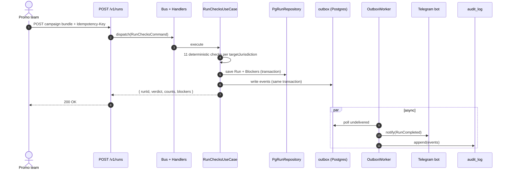
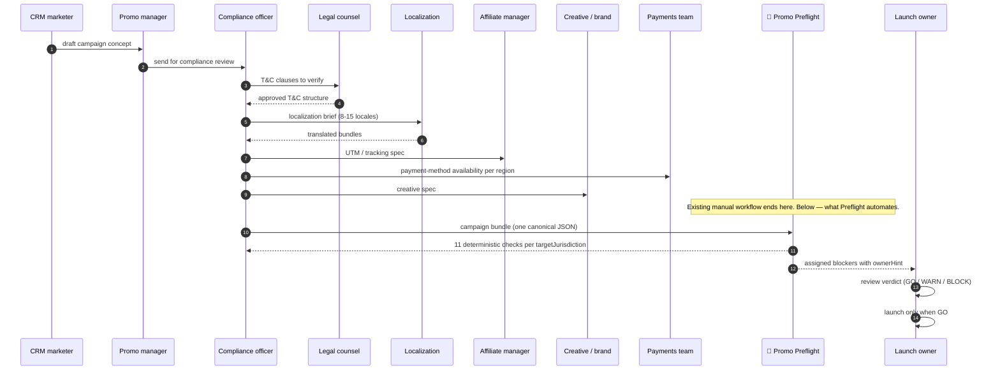
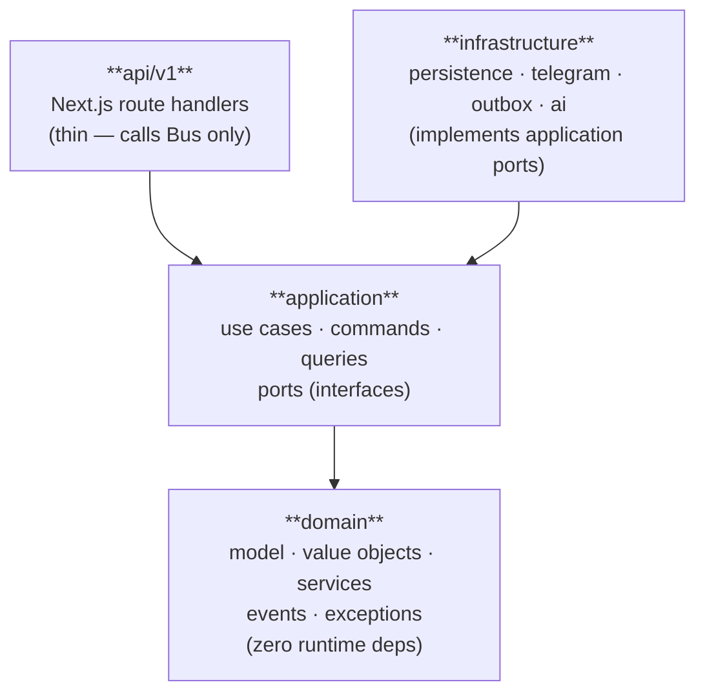
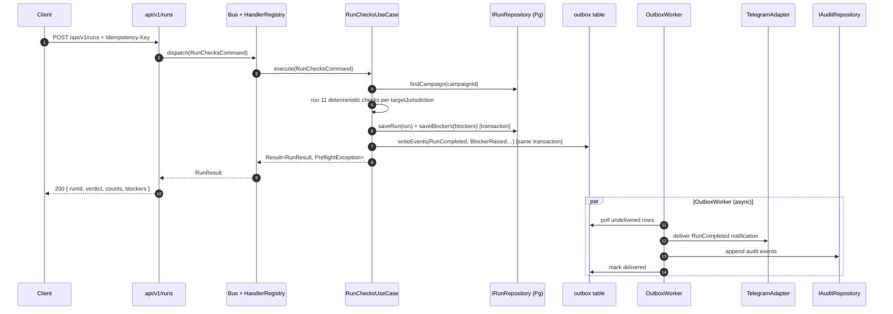

# TEXTS — single source of truth for all English copy

> Every piece of English text that lands in README, docs/, ADRs, case study, Telegram templates lives here first. Workers generate into this file. You polish (especially anything that will be translated to Russian or needs de-AI-ifying). Coordinator copies the final into target files during Block 11.
>
> **Convention**: each section has a status marker — `<!-- STATUS: empty | drafted | polished | shipped -->`. Workers update on completion. You set `polished` after your manual pass.

---

# Verbatim quotes — DO NOT EDIT

> These are direct verifiable citations. Workers must use them verbatim with attribution. Never paraphrase regulatory quotes.

## From 01.tech × G GATE MEDIA Global iGaming Report 2026

**Станислав, SEO Product Manager 01.tech** (Ch.5.3) — **the #1 quote for the README pain section**:
> «Ключевым и очень недооценённым трендом в 2026 году я бы назвал не ИИ или кор-апдейты, а возрастающие локальные блокировки и регуляторное давление в Латинской Америке и Азии, которые начались ещё в прошлом году и затронули не только продукты, но и вебмастеров. Устойчивость инфраструктуры и слаженные процессы по отслеживанию и реакции на блокировки со стороны конкретных локальных операторов будут конкурентным преимуществом в этом году.»

English translation (use this in README):
> "The key and very underrated trend in 2026, in my view, is not AI or core updates, but the increasing local blockings and regulatory pressure in Latin America and Asia. These began last year and have hit not just products but webmasters too. Infrastructure resilience and tight processes for tracking and reacting to local-operator blocks will be the competitive advantage of this year." — **Stanislav, SEO Product Manager, 01.tech**, *Global iGaming Report 2026*

**Виктория, BDM 01.tech** (Ch.3):
> «Конкурентным преимуществом для успешного iGaming-продукта является не количество подключённых методов платежа, а способность выстраивать гибкую, локализованную и устойчивую платёжную экосистему, адаптированную под требования конкретного рынка.»

English:
> "The competitive advantage of a successful iGaming product is not the number of integrated payment methods but the ability to build a flexible, localized, and resilient payment ecosystem adapted to a specific market's requirements." — **Victoria, BDM, 01.tech**

**Александр Романов, Head of White Label 01.tech** (Ch.4 closing):
> «Максимальную ценность обретают экосистемные решения, которые объединяют трафик, продукт, аналитику, платежи и инфраструктуру в единую модель роста.»

English:
> "Ecosystem solutions that unify traffic, product, analytics, payments, and infrastructure into a single growth model gain the most value." — **Alexander Romanov, Head of White Label, 01.tech**

**Аскер, CEO 100HP** (Ch.6 — localization):
> «Мы не просто переводим игры на другой язык. Мы перестраиваем их мир так, чтобы он полностью соответствовал культурному коду конкретного региона.»

English:
> "We don't just translate games to another language. We rebuild their world so it fully matches the cultural code of the specific region." — **Asker, CEO, 100HP**

## From DEEP-RESEARCH.md (verified external citations)

**Emmanuel Omoloyin, SEO Content Writer** (DEEP-RESEARCH §7, citation 169):
> "Wagering requirements, time limits, eligible games and maximum bet restrictions MUST BE clearly stated."

> "Gamble responsibly as a footer link no longer satisfies several jurisdictions."

**Industry Compliance Manager, iGaming** (DEEP-RESEARCH §7, citation 169):
> "Affiliate marketing is becoming a compliance blind spot — you're liable for what affiliates publish on your behalf, and manual review simply doesn't scale."

**ASA verdict on PokerStars promo** (DEEP-RESEARCH §1, citation 25):
> "We concluded the ad was irresponsible and breached the Code. The ad must not appear again."

**CONAR (Brazilian advertising self-regulator), 2024** (DEEP-RESEARCH §1):
> The phrase **«vencer é só o começo»** (winning is just the beginning) was ruled non-compliant because it "creates unrealistic expectations and promises guaranteed financial success."

## Industry estimates — MUST be marked with `*industry estimate*` footnote when used

These numbers come from OLD-RESEARCH §2, ChatGPT's own dip-research synthesis. They are **not** verified hard data — public iGaming operators do not publish promo-launch metrics. Use them with the explicit `*industry estimate, no public hard data*` markdown footnote whenever they appear in README / pain section / case study:

- **20-30 promo campaigns per month** for a mid-size operator
- **2-5 person-hours of review** per campaign (marketing + legal + compliance combined)
- **5-10% of campaigns** are pulled / corrected post-launch due to compliance issues
- **8-15 locales** supported by typical multi-jurisdiction operator
- **10-30 person-hours** to fully prepare a Brazilian welcome-offer launch (from DEEP-RESEARCH §8 — closer to verified because built on specific case walkthrough)

When workers cite these in any text, format must be:
```
20-30 promo campaigns a month*

*Industry estimate per OLD-RESEARCH §2; no public operator metrics published.
```

## Competitive positioning — canonical formulation (use verbatim)

This is the **canonical** way to frame the competitive landscape. Workers may NOT improvise this — paste as-is and let owner polish only the surface phrasing, not the content.

```
On the market, no publicly-available product for multi-jurisdictional promo compliance in iGaming currently exists. This is confirmed by two independent research passes (DEEP-RESEARCH §6 and OLD-RESEARCH §4) covering SoftSwiss, BetConstruct, EveryMatrix, Pronet Gaming, NuxGame, White Hat Gaming, Digitain, and ProgressPlay — none publicly offer automated promo-compliance tooling.

Internal solutions inside large operators (Bet365, Pokerstars-class) may exist but are closed and not tradeable. Preflight closes this gap as an open-source layer that any operator can adopt without license negotiation.

Notably, 01.tech's own 159-page Global iGaming Report 2026 identifies "local blockings and regulatory pressure in Latin America and Asia" (Stanislav, SEO Product Manager) as the #1 underrated risk of 2026 — yet none of the white-label platforms (including 01.tech's own product line) addresses this with a dedicated pre-launch readiness layer.
```

## From OLD-RESEARCH.md (verified UK / Sweden / Ontario citations)

**Adam Mateja, CRM / Product, Blurrify, 2024**:
> "Promotions in iGaming are one of those things that look simple on paper, and then turn into a lot of manual work."

> "Setting up iGaming promos manually is a pain; it's slow, and you're usually too late to react to what's happening on the pitch."

**Dr. Karin Schnarr, CEO and Registrar, AGCO Ontario, 2025**:
> "An offer that requires a player to sustain substantial losses for a perceived benefit is not a fair offer."

## Verified fines table (use in README pain bullets and CASE-STUDY alternate-timeline)

| Operator | Year | Regulator | Amount | Cause |
|---|---|---|---|---|
| **Perfect Storm B.V.** + **Rossobash S.r.l.** | Apr 2026 | DGOJ Spain | **€5M each + 2-year ban** | Illegal advertising / unlicensed betting operations |
| **Sky Betting & Gaming** (Bonne Terre) | 2022 | UKGC | **£1.17M** (~€1.4M) | Welcome bonus emails sent to 41,395 self-excluded + 249,159 unsubscribed |
| **BV Gaming** (BetVictor) | 2022 | UKGC | **£2M** (~€2.4M) | Cashback bonus terms not transparent — unfair to consumers |
| **Spooniker** (Kindred) | 2020 | Spelinspektionen | **SEK 100M → 30M** (~€2.6M) | Single-bonus-rule violation |
| **BGO Entertainment** | 2017 | UKGC | **£300K** (~€360K) | Misleading bonus promotions, partly via affiliate channels |
| **BetMGM Canada** | 2025 | AGCO Ontario | **C$110K** | Welcome bonus advertising (prohibited in Ontario) |
| **Well Played Media** (Casino Days) | 2025 | AGCO Ontario | **C$54K** | 35× wagering bonus deemed not a fair offer |
| **LeftLanePapi** (influencer) | Jul 2025 | KSA Netherlands | **€25K per violation** | Promoting unlicensed Skyhills |
| **William Hill** | Oct 2025 | ASA UK | (Withdrawal ordered) | Misleading "£40 from £20" promo — actual minimum stake was £40 |

---

# README — full content

<!-- STATUS: empty -->

## Hero block (T-002)

<!-- Owner: this is the first thing Nina sees. Polish ruthlessly. -->

```
# Promo Preflight

*Pre-launch readiness checks for iGaming operators expanding into emerging markets. Built by a PM over a weekend with Claude Code.*

*Built around the regulatory realities described in the [01.tech × G GATE MEDIA Global iGaming Report 2026](link-tbd).*

[] [] [] [] []

<!-- TODO: insert hero from VISUALS §1 -->

[Live demo](https://promo-preflight-production.up.railway.app/) · [Docs](./docs) · [Case study](./docs/CASE-STUDY.md)

---
```

## The problem (T-001)

<!-- STATUS: empty -->
<!-- Worker: produce 3 bullets each citing a verifiable source from the "Verbatim quotes" block above. Tone: direct, technical, slightly self-aware. Max 350 words for the entire section. -->

```
TBD by T-001 worker. Use:
- Bullet 1: Stanislav quote (translated) — local-blocking trend as #1 risk for 2026
- Bullet 2: Olomoyin quote — wagering requirements must be stated; "Gamble responsibly" footer is not enough
- Bullet 3: Verified fines table — pick 3 most striking (Perfect Storm €5M, Sky £1.17M, Kindred SEK 100M)
- Closing paragraph: why existing tooling fails (scattered Notion + Slack + Google Doc + Excel across 8-15 locales)
- Closing paragraph: what Preflight does differently (deterministic checks per jurisdiction, one canonical bundle, audit-friendly events, drops into your stack via REST + Telegram webhook)
```

## What this is

<!-- STATUS: empty -->
<!-- Worker T-003: 2-3 paragraphs. Reference 11 jurisdictional checks. Mention the Before/After collage from VISUALS §2. -->

```
TBD by T-003. After this paragraph, insert HTML <table> with VISUALS §2 before/after collage.
```

## Who this is for (T-003)

<!-- STATUS: empty -->
<!-- Worker: markdown table, 3 rows, columns "You are" and "What this gives you" -->

```
| You are | What this gives you |
|---|---|
| A multi-jurisdiction iGaming operator (lic. EU + LATAM + offshore) | Catch jurisdictional risks before promo launches — Brazilian SPA, Indian UPI ban, Mexican SPEI rules, Algerian crypto prohibition |
| A platform / white-label engineer at a B2B iGaming infrastructure provider (01.tech, SoftSwiss, BetConstruct, EveryMatrix tier) | Drop-in pre-launch gate your operator customers can add to their CRM / Promo workflow without your platform team owning compliance |
| A CRM / Promo Ops lead launching campaigns across 8-15 locales every month | Replace the Notion → Slack → Google Doc → Excel review chain with one deterministic check and one Telegram alert with assignable owners |
```

## How it works (T-003)

<!-- STATUS: empty -->
<!-- Worker: insert mermaid sequence below + paragraph + Telegram screenshot reference (VISUALS §6) -->

### Mermaid: data flow sequence



### Mermaid: Preflight in your workflow



<!-- TODO: under the second diagram, insert VISUALS §6 Telegram screenshot -->

## Three paths to use (T-003)

<!-- STATUS: empty -->
<!-- Three numbered sub-sections -->

```
### 1. Self-host via docker-compose
TBD: minimum commands. git clone, docker-compose up -d, curl POST.

### 2. Drop into your CI (npm package + CLI)
TBD: bin/preflight-check usage. Exit codes. JSON output. Mark "coming with T-033".

### 3. Managed SaaS
TBD: "Coming soon. Email <link> for early access."
```

## Tech stack (T-003)

<!-- STATUS: empty -->
<!-- markdown table of stack with one-line rationale per dep -->

```
TBD: Next.js 16, React 19, TypeScript strict, Drizzle ORM, Postgres, vitest, Zod, @anthropic-ai/sdk (optional), yaml, Telegram Bot API.
```

## Architecture (T-003)

<!-- STATUS: empty -->
<!-- ASCII tree of domain/application/infrastructure/api layout -->

```
TBD: copy from EXPLAINER section + ARCHITECTURE.md doc.
```

## What we deliberately don't do (T-003)

<!-- STATUS: empty -->
<!-- Bullet list of explicit non-goals with rationale -->

```
- No multi-tenant (org-scoped data) — out of scope for this sprint; can be added without changing core
- No gRPC — REST + webhooks fit the consumer model (CRM/Promo Ops teams)
- No live LLM in default checks path — checks must be deterministic and reproducible; AI is an optional augmentation only (see ADR-0003 + ADR-0005 for the planned augmentation roadmap)
- No auth — out of scope for demo; production deployment expects auth at infra layer
- No microservices — one process; outbox worker is a separate entrypoint of the same binary
- No "promo compliance score" magic number — verdicts are GO / WARN / BLOCK based on rule severity, not opaque AI
```

## AI augmentation roadmap (T-003 — new sub-section, after "What we deliberately don't do")

<!-- STATUS: empty -->
<!-- Short ~150-word section between "What we don't do" and "Contributing". Frames the AI roadmap. References ADR-0005. -->

```
TBD by T-003 worker. Include:
- Opening line: "Preflight ships a deterministic-first compliance core. AI is the planned augmentation layer on top — never the decision-maker."
- 5 bullets matching ADR-0005's five augmentations:
  1. PDF / text extraction — drop a T&C PDF, get a campaign bundle
  2. Fix-suggestion per blocker — 3 locale-aware replacement variants
  3. Cultural localization audit — catches culture mismatches regex misses
  4. Plain-language explanation per blocker — why, which regulator, which article
  5. Compliance Q&A grounded in the rule artifacts
- Closing: "See ADR-0005 for full reasoning. None of these ship in v1.0; the deterministic kernel does. AI lands incrementally in v1.x."
- Quote Romanov from G GATE Ch.4: "AI is becoming the base tool of the industry — not as a replacement but as a multiplier of effectiveness."
```

## Contributing / License / Author (T-003)

```
Issues and PRs welcome. Apache 2.0.

Built by Alexander Ulanov — PM with 6+ years in digital production, e-commerce, and TV.
[github.com/UlaYuga](https://github.com/UlaYuga)
```

---

# docs/ARCHITECTURE.md (T-006)

<!-- STATUS: drafted -->

# Promo Preflight — Architecture

## Layers



`api/` never imports `infrastructure/` directly. `domain/` has no outgoing dependencies on any other layer. `infrastructure/` implements interfaces (ports) declared in `application/port/`.

## Source layout

```
domain/
  model/         # Aggregates: Campaign, Run, Blocker, Owner
  vo/            # Value objects: Amount, Url, Locale, Severity (branded types)
  service/       # Pure domain services: ReadinessCalculator, BlockerDiff
  event/         # Sealed PreflightEvent discriminated union
  exception/     # PreflightException hierarchy
application/
  command/       # Pure command DTOs
  query/         # Pure query DTOs + view shapes
  usecase/       # Orchestrators that call ports + domain
  port/          # Interfaces for infrastructure: IRunRepository, ITelegramAdapter, IAuditRepository, IEventPublisher
  bus/           # Bus + HandlerRegistry
infrastructure/
  persistence/   # Drizzle/Postgres implementations of repositories
  telegram/      # Telegram bot adapter
  outbox/        # Outbox publisher + worker
  ai/            # Anthropic adapter (optional)
  handler/       # Command/query handler implementations
  registry/      # DI registry, Bus factory
api/
  v1/            # Next.js API route handlers — thin, all through Bus
```

**domain/** owns business concepts and rules. It has no knowledge of databases, HTTP, or external services.

**application/** orchestrates domain operations and declares *what it needs* via ports. It does not know *how* those ports are implemented.

**infrastructure/** implements every port and may import any external library. It never calls use cases directly.

**api/** translates HTTP requests into Commands/Queries, dispatches them through the Bus, and returns HTTP responses. It contains no business logic.

## Data flow

Full lifecycle of `POST /api/v1/runs`:



## Key invariants

- `domain/` has zero runtime dependencies on anything outside `domain/`.
- Ports are owned by `application/port/`; implementations live in `infrastructure/`.
- Commands return `Result<T, PreflightException>`; queries return `T` or throw `NotFoundException`.
- All write paths go through repositories — no direct SQL outside `infrastructure/persistence/`.
- Events are published after DB commit (outbox pattern) — no phantom events on rollback.
- `Idempotency-Key` is required on `POST /api/v1/runs`; the same key always returns the same `runId`.
- All API input is validated by Zod schemas owned by `application/`.
- Domain throws only `PreflightException` subclasses, never raw `Error`.

## Dependencies

| Package | Why |
|---|---|
| `next` 16 | App Router + React Server Components — single process hosts both API and UI |
| `drizzle-orm` + `postgres` | Type-safe SQL with zero-overhead query builder; migrations via Drizzle Kit |
| `zod` | Runtime validation at all system boundaries; types derived from schemas via `z.infer<>` |
| `vitest` | Fast unit + integration tests; compatible with ESM and TypeScript path aliases |
| `@anthropic-ai/sdk` | Optional AI augmentation layer; swapped for stubs when `USE_MOCK_AI=true` |
| `yaml` | Parses jurisdiction rule artifacts (`rules/*.yaml`) at boot — no runtime YAML parsing |
| Telegram Bot API | Outbound notifications to the compliance team channel via outbox worker |

## What we deliberately don't do

- **No multi-tenant / RLS** — out of scope for this sprint; adding `org_id` to all tables plus Row-Level Security is the natural extension, no domain changes needed.
- **No gRPC** — REST + Telegram webhook fit the consumer model (CRM / Promo Ops teams don't run gRPC clients).
- **No live LLM in the default checks path** — checks must be deterministic and reproducible; a regulator asking "why was this flagged" cannot accept "the LLM said so." AI is an optional augmentation layer (see [ADR-0003](./adr/0003-deterministic-first-ai-second.md) and [ADR-0005](./adr/0005-ai-augmentation-roadmap.md)).
- **No auth** — out of scope for the demo; production deployments expect auth at the infrastructure layer (Cloudflare Access, nginx basic-auth, or API gateway).
- **No microservices** — one process for now; the outbox worker is a separate entrypoint of the same binary, not a separate service.
- **No opaque "compliance score"** — verdicts are `GO` / `WARN` / `BLOCK` based on rule severity, not an aggregate number.

---

# docs/API.md (T-007)

<!-- STATUS: empty -->
<!-- 8 endpoints + Error model table + Versioning policy -->

```
TBD by T-007. POST /api/v1/runs, GET /v1/runs/:id, GET /v1/campaigns, GET /v1/campaigns/:id, GET /v1/campaigns/:id/versions, GET /v1/campaigns/:id/diff, GET /api/health, GET /api/ready.
```

---

# docs/CONFIGURATION.md (T-008)

<!-- STATUS: empty -->
<!-- Required env vars, optional env vars, .env example, per-environment notes -->

```
TBD by T-008.
```

---

# docs/ERRORS.md (T-008)

<!-- STATUS: empty -->
<!-- PreflightException hierarchy, how to throw, rules, adding new exceptions -->

```
TBD by T-008.
```

---

# docs/INTEGRATIONS.md (T-008 + expanded in T-024)

<!-- STATUS: empty -->
<!-- Currently supported: Telegram (full step-by-step). Roadmap: Slack, Jira, Linear, Discord. Build your own adapter guide. -->

```
TBD by T-008 / T-024.
```

---

# docs/CASE-STUDY.md (T-035)

<!-- STATUS: empty -->
<!-- Brazilian welcome offer walkthrough under SPA/MF Q2 2026 -->
<!-- Pull directly from DEEP-RESEARCH.md §8 for: required T&C in PT-BR, 10 blockers table, fixed version, alternate timeline citing Perfect Storm €5M. -->

```
TBD by T-035. Source: DEEP-RESEARCH.md §8 + verified fines table above + Stanislav quote as closing.
```

---

# docs/adr/0001-postgres-over-localstorage.md (T-009)

<!-- STATUS: empty -->

```
TBD by T-009 worker. Format: Michael Nygard's ADR. Context, Decision, Consequences (positive + negative + neutral). 200-350 words.
```

---

# docs/adr/0002-cqrs-lite-bus.md (T-009)

<!-- STATUS: empty -->

```
TBD by T-009.
```

---

# docs/adr/0003-deterministic-first-ai-second.md (T-009)

<!-- STATUS: empty -->

```
TBD by T-009.
```

---

# docs/adr/0004-outbox-pattern-for-events.md (T-009)

<!-- STATUS: empty -->

```
TBD by T-009.
```

---

# docs/adr/0005-ai-augmentation-roadmap.md (T-009b)

<!-- STATUS: empty -->
<!-- Worker: this ADR is "Accepted, deferred" — documents that AI features are planned but intentionally not built in v1. -->

```
TBD by T-009b worker. Michael Nygard format. Key points:

Context:
- The 11 deterministic checks form a defensible compliance core (per ADR-0003).
- Anthropic SDK wrapper already exists at lib/ai/ but is not wired into the main flow.
- AI offers a clear multiplier on UX (per the 01.tech G GATE Report Ch.4, Romanov: "AI is becoming the base tool of the industry — not as a replacement but as a multiplier of effectiveness").
- A set of high-leverage AI augmentations have been scoped but not built in v1.

Decision:
Document AI augmentation as a planned v1.x roadmap, not v1. Five specific augmentations are scoped:
1. PDF/text extraction — operator drops 5-page T&C → AI extracts structured fields → deterministic flow continues.
2. Fix suggestion per blocker — for each block, AI generates 3 replacement variants in the target locale preserving marketing intent.
3. Cultural localization audit — AI catches culture-specific mismatches regex misses (alcohol in Malaysia, religious imagery, gender-coded references).
4. Plain-language explanation per blocker — why this is bad, which regulator, which article, in marketer's language not lawyer's.
5. Compliance Q&A — operator asks "can I say X in Brazil?" → AI answers grounded in DEEP-RESEARCH knowledge base.

All five remain "AI on top of deterministic core" — AI never decides verdicts.

Consequences:
- Positive: clear separation between defensible compliance kernel and UX-multiplier layer. Future v1.x work can ship one augmentation at a time without disturbing the kernel. Owner sets clear expectation: deterministic is the contract, AI is the experience.
- Negative: Until v1.x ships, marketer still reads raw rule_id strings and has to manually rephrase blocked copy. Some operators expecting "AI-powered" branding may underestimate the value of deterministic-first.
- Neutral: When AI augmentation lands, it requires its own ADRs (cost budget, model selection, prompt cache strategy, evaluation harness).
```

---

# Telegram message templates (T-024)

<!-- STATUS: empty -->
<!-- MarkdownV2 format, three templates: GO / WARN / BLOCK -->

### Template — GO

```
✅ Run *{runId}*: all checks passed
Campaign: {campaignName} ({targetJurisdiction})
View: {runUrl}
```

### Template — WARN

```
⚠️ Run *{runId}*: {warnings} warnings, 0 blockers — review before launch
Campaign: {campaignName} ({targetJurisdiction})
Top warnings:
• {top3WarningSummaries}
View: {runUrl}
```

### Template — BLOCK

```
🚨 Run *{runId}* BLOCKED ({blockers} blockers, {warnings} warnings)
Campaign: {campaignName} ({targetJurisdiction})
Owners to notify: {ownerHints}
Top blockers:
• {top3BlockerSummaries}
View: {runUrl}
```

---

# Notes for the owner

1. **Polishing pass**: after each worker fills a section, your job is to re-read with one filter — *would Nina believe this came from a competent PM*? Specifically:
   - Cut "powered by AI", "revolutionary", "next-gen", any superlative
   - Replace "we believe" / "we think" with concrete statements
   - If a sentence could have come from a marketing brochure, rewrite it as a technical statement
   - Russian preview: think about how you would translate each sentence — if it sounds awkward in Russian, it's probably AI-toned in English too
2. **Verbatim quotes never get re-worded.** If a worker paraphrases a quote, reject the change.
3. **Status markers:** update `<!-- STATUS: empty -->` → `drafted` → `polished` → `shipped` as the file moves through stages.
4. **Final assembly**: in Block 11, the coordinator (or you) copies each section from here into its target file (README.md, docs/ARCHITECTURE.md, etc.). Only `polished` content gets copied.
