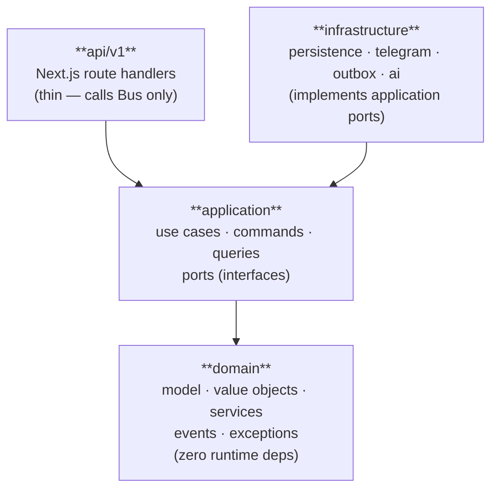
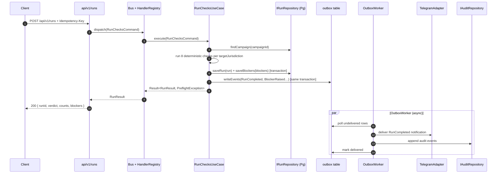

# Promo Preflight — Architecture

## Layers



[`api/`](../api/) never imports [`infrastructure/`](../infrastructure/) directly. [`domain/`](../domain/) has no outgoing dependencies on any other layer. [`infrastructure/`](../infrastructure/) implements interfaces (ports) declared in [`application/port/`](../application/port/).

## Source layout

```
domain/
  model/         # Aggregates: Campaign, Run, Blocker, Owner
  vo/            # Value objects: Amount, Url, Locale, Severity (branded types)
  service/       # Pure domain services: ReadinessCalculator, BlockerDiff
  event/         # Sealed PreflightEvent discriminated union
  exception/     # PreflightException hierarchy
application/
  command/       # Pure command DTOs
  query/         # Pure query DTOs + view shapes
  usecase/       # Orchestrators that call ports + domain
  port/          # Interfaces for infrastructure: IRunRepository, ITelegramAdapter, IAuditRepository, IEventPublisher
  bus/           # Bus + HandlerRegistry
infrastructure/
  persistence/   # Drizzle/Postgres implementations of repositories
  telegram/      # Telegram bot adapter
  outbox/        # Outbox publisher + worker
  ai/            # Anthropic adapter (optional)
  handler/       # Command/query handler implementations
  registry/      # DI registry, Bus factory
api/
  v1/            # Next.js API route handlers — thin, all through Bus
```

**[domain/](../domain/)** owns business concepts and rules. It has no knowledge of databases, HTTP, or external services.

**[application/](../application/)** orchestrates domain operations and declares *what it needs* via ports. It does not know *how* those ports are implemented.

**[infrastructure/](../infrastructure/)** implements every port and may import any external library. It never calls use cases directly.

**[api/](../api/)** translates HTTP requests into Commands/Queries, dispatches them through the Bus, and returns HTTP responses. It contains no business logic.

## Data flow

Full lifecycle of an authenticated `POST /api/v1/runs` integration request. The browser demo is a separate synthetic `localStorage` workflow; it does not call this protected route or carry `PREFLIGHT_API_KEY`. Its optional `POST /api/brief-extraction` helper returns non-persisted candidate fields for human confirmation before local deterministic checks.



## Key invariants

- [`domain/`](../domain/) has zero runtime dependencies on anything outside `domain/`.
- Ports are owned by [`application/port/`](../application/port/); implementations live in [`infrastructure/`](../infrastructure/).
- Commands return `Result<T, PreflightException>`; queries return `T` or throw `NotFoundException`.
- All write paths go through repositories — no direct SQL outside [`infrastructure/persistence/`](../infrastructure/persistence/).
- Events are published after DB commit (outbox pattern) — no phantom events on rollback.
- `Idempotency-Key` is required on `POST /api/v1/runs`; the same key always returns the same `runId`.
- All API input is validated by Zod schemas owned by [`application/`](../application/).
- Domain throws only `PreflightException` subclasses, never raw `Error`.

## Dependencies

| Package | Why |
|---|---|
| `next` 16 | App Router + React Server Components — single process hosts both API and UI |
| `drizzle-orm` + `postgres` | Type-safe SQL with zero-overhead query builder; migrations via Drizzle Kit |
| `zod` | Runtime validation at all system boundaries; types derived from schemas via `z.infer<>` |
| `vitest` | Fast unit + integration tests; compatible with ESM and TypeScript path aliases |
| `@anthropic-ai/sdk` | Optional AI augmentation layer; swapped for stubs when `USE_MOCK_AI=true` |
| `yaml` | Parses configured policy/rule artifacts (`rules/*.yaml`) at boot — no runtime YAML parsing |
| Telegram Bot API | Outbound run-result notifications to the review channel via outbox worker |

## What we deliberately don't do

- **No multi-tenant / RLS** — out of scope for this sprint; adding `org_id` to all tables plus Row-Level Security is the natural extension, no domain changes needed.
- **No gRPC** — REST + Telegram webhook fit the consumer model (CRM / Promo Ops teams don't run gRPC clients).
- **No live LLM in the default checks path** — findings must be reproducible from a submitted bundle and a versioned policy/rule artifact. AI is an optional augmentation layer (see [ADR-0003](./adr/0003-deterministic-first-ai-second.md) and [ADR-0005](./adr/0005-ai-augmentation-roadmap.md)).
- **No end-user accounts or browser sign-in** — the synthetic browser demo stays credential-free, while the `/api/v1/*` integration surface requires bearer authentication.
- **No microservices** — one process for now; the outbox worker is a separate entrypoint of the same binary, not a separate service.
- **No opaque policy score** — verdicts are `GO` / `WARN` / `BLOCK` based on configured rule severity, not an aggregate number.
